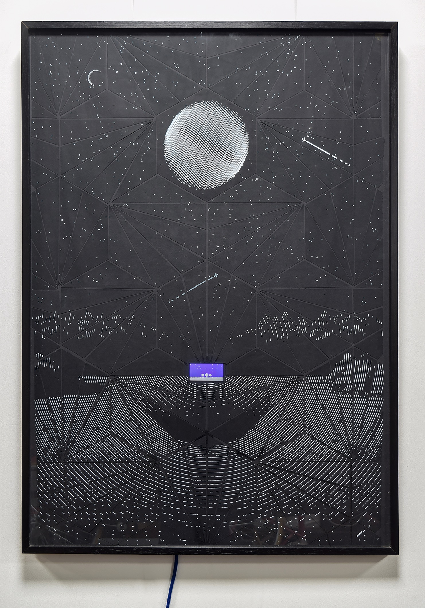

# Hasta las Estrellas

_Cielo, el mundo está ahí para compartirlocon quién quieras... si es tu deseo._

Ilustración aumentada. Dibujo con marcador de pintura blanca al agua sobre papel negro. Corte mecánico, pegado a mano; la precisión es maquínica, el error humano. Pantalla LCD con animación generada algorítmicamente.

**Obra Multimedia, 2019** 
Plotter de dibujo y corte con pantalla LCD 
72 x 102 cm
